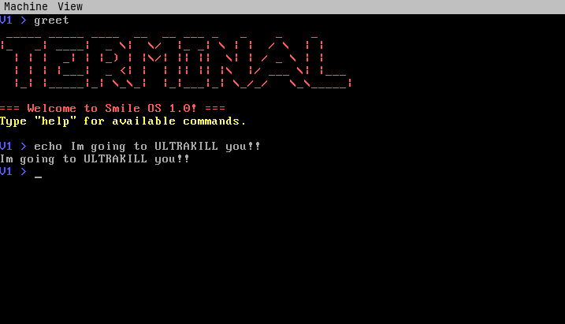

# Smile OS

a simple 32-bit x86 hobby OS written in C.
aesthetically mimics ULTRAKILL's (by Hakita) TERMINAL, but it's an older console version.



## Features
1. Working shell with commands (currently 4)
2. PS/2 Keyboard driver
3. GDT
4. IDT
5. Timer
6. VGA text mode

## Install

1. Get the ISO inside the /src directory of this repo

2. ```bash
   qemu-system-i386 -cdrom smile-os.iso
   ```

